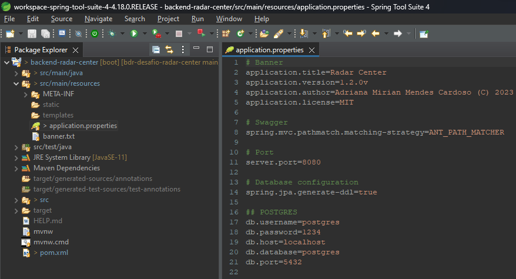
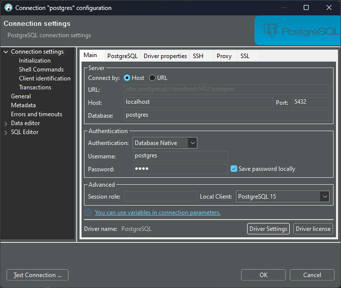
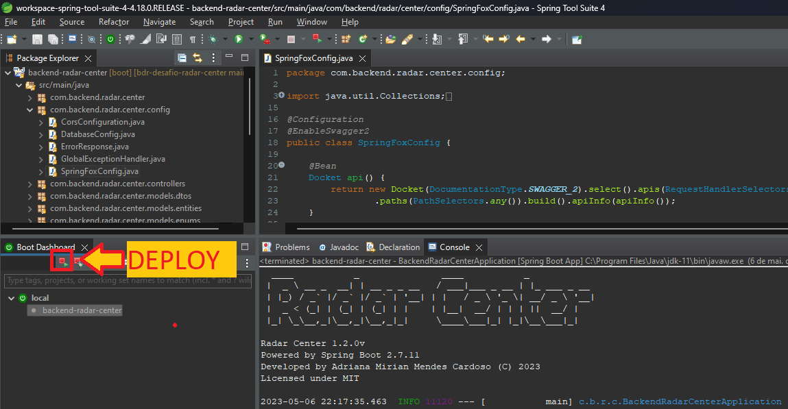
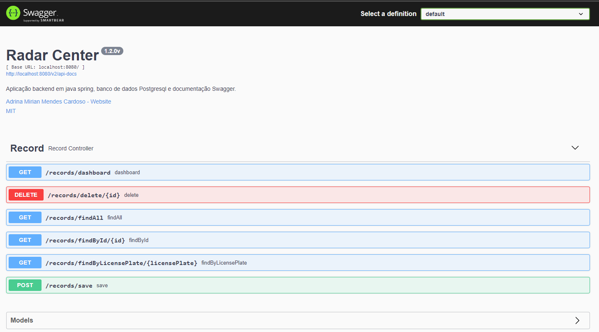
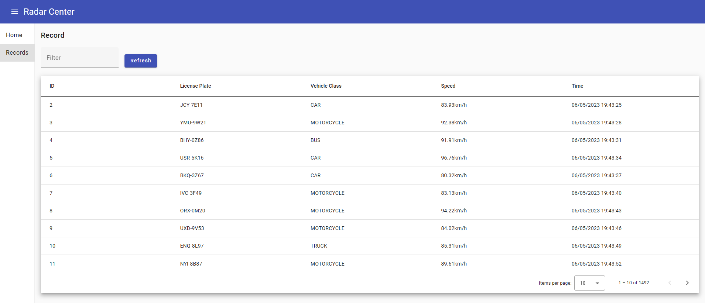

[](./LICENSE)      

# Radar Center

O projeto consiste no desenvolvimento de uma API e um Serviço. A aplicação WEB foi desenvolvida com backend em Java 11 + Spring Boot + Maven + PostgreSQL, Angular e documentação Swagger. O contexto da aplicação é sobre uma central de infrações, onde os registros são gerados de forma automatizada a cada três segundos e os dados são atualizados no dashboard a cada dez segundos.

## Teste localhost

Para testar localmente a aplicação, é preciso configurar o arquivo properties do backend conforme mostrado abaixo. No presente projeto foi utlizado a IDE Spring Tool Suite para realizar o deploy.

```
## POSTGRES
db.username=postgres
db.password=1234
db.host=localhost
db.database=postgres
db.port=5432
```








## Swagger

O projeto foi desenvolvido com a documentação Swagger, que está disponível no aquivo ```swagger.json```.

Para acessar a documentação swagger acesse esta URL: http://localhost:8080/swagger-ui/index.html



## Frontend Angular

Para executar a aplicação frontend é preciso ter o Node e NPM instalado no ambiente e executar o comando npm start e acessar o link http://localhost:4200/




## Licença

Este projeto está sob licença MIT © 2023 Adriana Mirian Mendes Cardoso.
Para mais informações acesse o arquivo :scroll: `LICENSE`.

## Contato

:email: E-Mail: ​[adrianamirianmc@gmail.com](adrianamirianmc@gmail.com)

:clipboard: Linkedin: ​[https://www.linkedin.com/in/amendescardoso](https://www.linkedin.com/in/adriana-mirian-mendes-cardoso)

:package: GitHub:  [https://github.com/AdrianaMendes](https://github.com/AdrianaMendes)